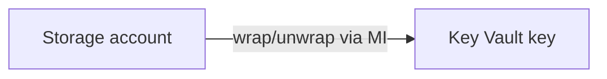

# Customer-managed keys — Azure Storage and SQL TDE

## Objective

Explain how **customer-managed keys (CMK)** protect artifact blob storage in Azure, and where **SQL TDE** fits for database encryption at rest.

## Assumptions

- Artifact storage is provisioned with `infra/terraform-storage/` (`enable_storage_account = true`).
- A **Key Vault** exists (see `infra/terraform-keyvault/` or an existing vault) with a **RSA** or **EC** key suitable for storage encryption.

## Constraints

- Storage CMK in Terraform requires the **full key version resource id** (`customer_managed_key_id`).
- Key Vault **network** rules and **managed identity** access must allow the storage service to unwrap keys (Microsoft docs: *Customer-managed keys for Azure Storage*).
- **SQL TDE** with CMK is a **database** operator concern: configure the SQL managed instance or Azure SQL logical server with a KV key in the Azure portal or a dedicated SQL Terraform module (not duplicated in the ArchLucid app repo DDL).

## Architecture overview

## Terraform

- `infra/terraform-storage/variables.tf` — `customer_managed_key_enabled`, `customer_managed_key_id`.
- `infra/terraform-storage/main.tf` — `azurerm_storage_account_customer_managed_key` when enabled and id is non-empty.

## Security

- Use **private endpoints** for Key Vault and storage; deny public access where policy allows.
- Rotate keys using Key Vault **new version** and update `customer_managed_key_id` with a planned re-encryption window.

## Reliability

- Test fail-open behaviour in a non-production subscription before enforcing CMK in production.

## Cost

- Key Vault operations and storage encryption are usually modest versus blob egress; monitor Key Vault transaction metrics.

## SQL TDE (operator note)

- Enable TDE on the **server** or **managed instance**; for CMK-backed TDE follow Microsoft Learn for **Azure SQL transparent data encryption with customer-managed key in Azure Key Vault**.
- ArchLucid **master DDL** (`ArchLucid.Persistence/Scripts/ArchLucid.sql`) does not configure TDE — that remains platform infrastructure.
