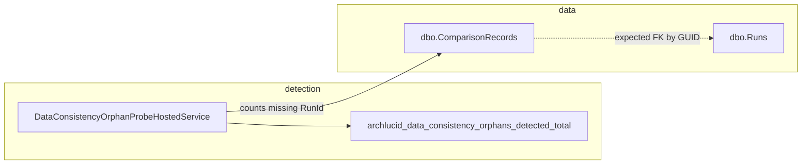

> **Scope:** Runbook: Comparison record orphans (missing authority run) - full detail, tables, and links in the sections below.

> **Spine doc:** [Five-document onboarding spine](../FIRST_5_DOCS.md). Read this file only if you have a specific reason beyond those five entry documents.


# Runbook: Comparison record orphans (missing authority run)

**Last reviewed:** 2026-04-16

## Objective

Remove or inspect **`dbo.ComparisonRecords`** rows whose **`LeftRunId`** or **`RightRunId`** parses as a **GUID** but **no** matching **`dbo.Runs.RunId`** exists. This state is **inconsistent** with the authority run model. The product probe (`DataConsistencyOrphanProbeHostedService`) is **detection-only** for counts and metrics; it never **`DELETE`**s. Optionally set **`DataConsistency:OrphanProbeRemediationDryRunLogMaxRows`** to a value **1–500** so each probe pass that finds orphans also logs an **Information**-level sample of candidate keys using the same **`SELECT`** as admin dry-run (golden manifests and findings snapshots use the same option when their counts are non-zero). **Execute** remediation only via the Admin API or approved SQL.

## Assumptions

- You use **SQL Server** persistence (not InMemory).
- You have permission to run diagnostics **`SELECT`** and, if approved, **`DELETE`** in the target database.
- **RLS** or tenant scoping: if enabled, use a **maintainer / admin** connection or **`EXECUTE AS`** pattern approved by your security team.

## Constraints

- Do **not** delete rows merely because **`Runs.ArchivedUtc`** is set — archived runs still exist.
- Run **`DELETE`** only after **preview** counts match expectations and change control approves.
- Prefer fixing **upstream** lifecycle bugs if orphans recur.

## Architecture overview



## Preview (read-only)

**Left side references missing run:**

```sql
SELECT c.ComparisonRecordId, c.LeftRunId, c.CreatedUtc
FROM dbo.ComparisonRecords c
WHERE c.LeftRunId IS NOT NULL
  AND TRY_CONVERT(uniqueidentifier, c.LeftRunId) IS NOT NULL
  AND NOT EXISTS (
      SELECT 1
      FROM dbo.Runs r
      WHERE r.RunId = TRY_CONVERT(uniqueidentifier, c.LeftRunId));
```

**Right side references missing run:**

```sql
SELECT c.ComparisonRecordId, c.RightRunId, c.CreatedUtc
FROM dbo.ComparisonRecords c
WHERE c.RightRunId IS NOT NULL
  AND TRY_CONVERT(uniqueidentifier, c.RightRunId) IS NOT NULL
  AND NOT EXISTS (
      SELECT 1
      FROM dbo.Runs r
      WHERE r.RunId = TRY_CONVERT(uniqueidentifier, c.RightRunId));
```

## API-assisted remediation (preferred when API is available)

1. **Preview:** `POST /v1/admin/diagnostics/data-consistency/orphan-comparison-records?dryRun=true&maxRows=50`  
   - Requires **Admin** role / policy. Response lists **`comparisonRecordIds`** that would be removed (oldest first, capped at **500**).
2. **Execute:** `POST /v1/admin/diagnostics/data-consistency/orphan-comparison-records?dryRun=false&maxRows=50`  
   - Deletes the same shape of orphan rows as the SQL below (left **or** right run missing from **`dbo.Runs`**).  
   - Emits durable audit **`ComparisonRecordOrphansRemediated`** with deleted ids.

**Evidence for auditors:** retain the **dry-run** API response (or SQL preview row counts), the **execute** response with deleted ids, and the audit event reference — same retention as other remediation tickets.

**InMemory** storage returns an empty list (no SQL).

## Remediation (destructive)

**Idempotent delete** of rows with **either** side orphaned (adjust **`WHERE`** if you only fix one side):

```sql
DELETE c
FROM dbo.ComparisonRecords c
WHERE (
    c.LeftRunId IS NOT NULL
    AND TRY_CONVERT(uniqueidentifier, c.LeftRunId) IS NOT NULL
    AND NOT EXISTS (
        SELECT 1 FROM dbo.Runs r
        WHERE r.RunId = TRY_CONVERT(uniqueidentifier, c.LeftRunId))
)
OR (
    c.RightRunId IS NOT NULL
    AND TRY_CONVERT(uniqueidentifier, c.RightRunId) IS NOT NULL
    AND NOT EXISTS (
        SELECT 1 FROM dbo.Runs r
        WHERE r.RunId = TRY_CONVERT(uniqueidentifier, c.RightRunId)));
```

Run inside a transaction in **maintenance window**; verify **`@@ROWCOUNT`** against preview.

## Security model

- Least privilege: diagnostics role for **preview**; separate **break-glass** principal for **delete**.
- Log **who** ran remediation and **ticket** reference.

## Operational considerations

- After remediation, confirm **`archlucid_data_consistency_orphans_detected_total`** stops incrementing (see Prometheus alert **`ArchLucidDataConsistencyOrphansDetected`**).
- If orphans **reappear**, capture API/worker logs around run deletion or comparison creation and open a defect.
