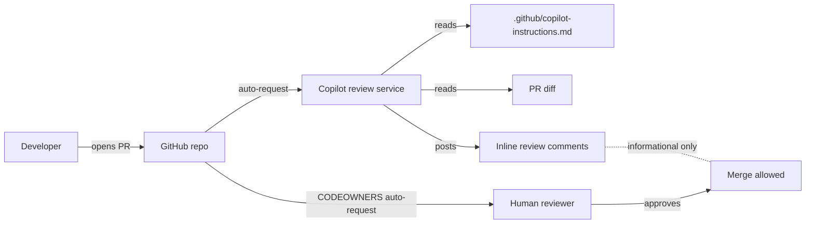

> **Scope:** Runbook — Enable GitHub Copilot code review (one-time setup) - full detail, tables, and links in the sections below.

# Runbook — Enable GitHub Copilot code review (one-time setup)

**Priority:** P3 — Reference (one-time setup, not an incident response)
**Owner:** Repo maintainer
**Last reviewed:** 2026-04-17
**Applies to:** `joefrancisGA/ArchLucid`

## Objective

Turn on **GitHub Copilot code review** so that Copilot is automatically requested as a reviewer on every pull request, using `.github/copilot-instructions.md` as project context. This runbook is the click-by-click follow-up to the in-repo files that were committed alongside it.

## Assumptions

- You have an active **Copilot Pro** subscription (verify at <https://github.com/settings/copilot>).
- You are the repo admin on `joefrancisGA/ArchLucid`.
- Branch protection / rulesets for `main` already exist (see [`.github/BRANCH_PROTECTION.md`](../../.github/BRANCH_PROTECTION.md)). This runbook does **not** modify them.

## Constraints

- This is a **GitHub server-side feature** — there is no CI workflow file to add. Anyone proposing `actions/copilot-review@vX` is mistaken; no first-party action exists at the time of writing.
- Copilot review pricing and feature availability have changed multiple times in 2024–2026. **Confirm the toggles below still exist in the UI** before relying on them; if GitHub has moved them, search the GitHub Docs for "Copilot code review".
- Copilot's reviews are **suggestions**, not gates. Copilot's own review status does **not** appear as a required check in branch protection — see "Limits" at the bottom.

## Architecture overview

- **Nodes:** Developer, GitHub repo, Copilot review service, Human reviewer.
- **Edges:** PR open → auto-request → review comments. CODEOWNERS handles humans; Copilot config handles the bot.
- **Boundary:** The `Copilot review service` runs on GitHub's infra. We do not control it; we only feed it context via `.github/copilot-instructions.md`.

## Component breakdown — what's already in the repo

| File | Purpose |
|------|---------|
| `.github/copilot-instructions.md` | Project context Copilot reads before reviewing each PR. Encodes security non-negotiables (SMB/445, private endpoints, Entra), architecture seams, C# style, the rename guardrails, and the "do not flag these legacy literals" allowlist. |
| `.github/CODEOWNERS` | Auto-assigns human reviewers on path patterns (security-sensitive paths route to maintainers). Independent of Copilot. |
| `.github/BRANCH_PROTECTION.md` | Existing doc for required status checks. Unchanged by this runbook. |

## Step-by-step setup

### Step 1 — Verify your Copilot subscription includes code review

1. Go to <https://github.com/settings/copilot>.
2. Confirm the page shows **Copilot Pro** (or higher) is **active**.
3. Under **Features**, confirm **Code review** is listed as enabled for your account. If it is not present, you may be on legacy Copilot Individual without the review SKU — open billing and confirm.

> If this section is missing entirely, GitHub may have reorganized the page. Search GitHub Docs for "Copilot code review" and follow the current path.

### Step 2 — Enable Copilot to act on this repository

1. Go to <https://github.com/settings/copilot/features> (Account-level Copilot policies).
2. Confirm **Copilot in pull requests** (or **Copilot code review**) is set to **Enabled**.
3. If your account uses repository-scoped allow lists, ensure `joefrancisGA/ArchLucid` is included.

### Step 3 — Turn on automatic review for this repo (Rulesets — current path)

GitHub’s documented path for **per-repository** automatic Copilot review is a **branch ruleset**, not a lone toggle under a sidebar heading named “Code & automation.” If you only see a top tab called **Code** (next to **Issues**, **Pull requests**), that is the **file browser** — you are not in **Settings** yet.

**Primary path (repository):**

1. Open the repo: <https://github.com/joefrancisGA/ArchLucid>.
2. Click **Settings** (gear). If you do not see **Settings**, you are not an admin on the repo — ask an owner to grant **Admin** or apply the ruleset for you.
3. In the **left sidebar**, open **Rules** → **Rulesets** (GitHub docs group this under *“Code and automation”* in prose; your UI may show **Rules** without that exact group title, or use a different section name — look for **Rulesets**, not the **Code** tab).
4. Click **New ruleset** → **New branch ruleset**.
5. **Ruleset name:** e.g. `Auto-request Copilot code review`.
6. **Enforcement status:** **Active**.
7. **Target branches:** **Add target** → e.g. **Include default branch** (or explicitly `main` / `master`).
8. Under **Branch rules**, enable **Automatically request Copilot code review** (this is a **standalone** rule — you do **not** need “Require a pull request before merging” for Copilot to run).
9. Optionally enable:
   - **Review new pushes** — Copilot re-reviews after new commits (recommended).
   - **Review draft pull requests** — reviews while PR is still draft.
10. Click **Create** (or **Save**).

Official reference: [Configuring automatic code review by GitHub Copilot](https://docs.github.com/en/copilot/how-tos/copilot-on-github/set-up-copilot/configure-automatic-review).

**Alternate — account-wide (your own PRs only, Copilot Pro):**

Profile picture → **Copilot settings** → enable **Automatic Copilot code review** for pull requests you open. That does **not** replace the repo ruleset if you want *every* contributor’s PRs reviewed.

**Legacy UI:** Some accounts still see repo **Settings → Copilot** with a direct toggle; if yours does, you can use it, but **Rulesets** is what GitHub documents for repositories as of this runbook’s last review.

### Step 4 — Verify the instructions file is being picked up

1. Open a small throwaway PR (e.g. typo fix in a doc).
2. Within ~30–90 seconds, Copilot should appear in the **Reviewers** sidebar with status **Reviewing**.
3. Once it posts review comments, scroll to the top of its review summary. Some Copilot UI versions display "Used custom instructions from `.github/copilot-instructions.md`" or a similar attribution.
4. If Copilot's comments visibly contradict instructions in `.github/copilot-instructions.md` (e.g. it suggests adding `ConfigureAwait(false)` in a test, or reintroducing an `ArchiForge*` config fallback), the file may not be loading. Check:
   - File path is **exactly** `.github/copilot-instructions.md` (lowercase, in the repo root `.github/` folder).
   - File is on the PR's **base branch** (Copilot reads from the base, not the PR head).
   - File size is under GitHub's documented limit (search docs for "copilot-instructions.md size").

### Step 5 — (Optional) Export the ruleset for traceability

Step 3 already creates the ruleset in the GitHub UI. To keep a copy in git:

1. After **Create**, open **Settings** → **Rules** → **Rulesets** and note the ruleset ID from the URL, or list via API.
2. Export: `gh api repos/joefrancisGA/ArchLucid/rulesets/<id>` and commit the JSON under `.github/rulesets/` if your team wants a paper trail (optional; GitHub remains source of truth).

> Caveat: GitHub's Terraform provider (`integrations/github`) supports rulesets via `github_repository_ruleset`, but the **Copilot review** branch rule may lag the web UI. Check the provider schema before encoding this in Terraform.

## Data flow — what Copilot sees

| Input | Source | Notes |
|-------|--------|-------|
| PR diff | GitHub | Standard unified diff. |
| File context around diff | GitHub | Limited window of surrounding lines. |
| Project instructions | `.github/copilot-instructions.md` on the **base branch** | Shapes tone, blocking rules, allowlists. |
| PR title + description | The author | Copilot weighs these heavily; encourage authors to write good descriptions. |
| Linked issues | The author / GitHub | Used for context if linked via `Closes #N` etc. |

Copilot does **not** see your private CI logs, your terminal, your Cursor chat history, or files outside the diff plus their immediate context window.

## Security model

- **No new secrets are required.** Copilot review uses your existing GitHub identity via the Copilot subscription. There is no service principal or webhook to provision.
- **No outbound traffic from your infra.** Review runs on GitHub's side; nothing in `infra/` changes.
- **Data sent to OpenAI / Microsoft.** Copilot review sends PR diffs and `copilot-instructions.md` content to the underlying model. **Do not** put real secrets in `copilot-instructions.md`. The current file is safe — it contains only conventions and links.
- **Tenant data exposure.** PRs that include real tenant data fixtures, real customer names, or real connection strings will leak that to the model. Continue to rely on the gitleaks gate (`.github/workflows/ci.yml`) to keep those out.
- **Aligned with workspace defaults:** Entra ID identity, no public exposure of storage, no port 445 anywhere — Copilot review introduces no new public attack surface because it runs server-side at GitHub.

## Operational considerations

- **Cost:** Copilot review is included in Copilot Pro at the subscription level — no per-PR billing surprise. If you later add an org and want it on every member's PRs, switch to Copilot Business / Enterprise; that is a billing decision, not a code change.
- **Reliability:** When Copilot is degraded, PRs still merge — Copilot's review is informational. Watch <https://www.githubstatus.com/> for `Copilot` component degradations.
- **Noise control:** If Copilot's reviews become noisy on a particular path (e.g. generated code, vendored files), tighten `.github/copilot-instructions.md` — Copilot honors "do not comment on …" guidance there. As a last resort, add the path to `.gitattributes` with `linguist-generated=true`; some Copilot UI versions skip generated files.
- **Updating the instructions:** Treat `.github/copilot-instructions.md` like any other code change — PR + human review. CODEOWNERS already requires maintainer review on it.
- **Rename impact (Phase 7.6):** When the GitHub repository is eventually renamed `ArchiForge` → `ArchLucid`, this runbook's URLs in **Step 3** must be updated. Copilot configuration itself follows the repo by ID and survives the rename automatically.

## Limits — read this so you aren't surprised

- **Copilot is not a required check.** Branch protection cannot block merge on "Copilot approved" — there is no signal exposed for that. Required checks remain the CI workflows listed in [`.github/BRANCH_PROTECTION.md`](../../.github/BRANCH_PROTECTION.md).
- **Copilot does not run your tests.** Coverage gaps it spots are based on diff inspection, not execution.
- **Copilot does not have repo-wide context.** It sees the diff plus a small window. Architectural reviews ("this should live in `Application` not the controller") still need a human.
- **Copilot can be wrong.** Especially about Azure SDK semantics, Dapper edge cases, and SQL plan choice. Treat its suggestions as a starting point.
- **First-PR latency.** The first PR after enabling auto-review can take a few minutes while GitHub provisions per-repo state. Subsequent PRs are typically under a minute.

## Rollback

If Copilot review becomes a problem:

1. Settings → Code & automation → Copilot → toggle **Automatic review** **Off**.
2. Existing PRs already reviewed retain their comments; no further automatic reviews fire.
3. `.github/copilot-instructions.md` and `.github/CODEOWNERS` can stay — they do no harm with auto-review off, and CODEOWNERS is independently useful.

## Cross-references

- `.github/copilot-instructions.md` — what Copilot reads
- `.github/CODEOWNERS` — human reviewer routing
- [`.github/BRANCH_PROTECTION.md`](../../.github/BRANCH_PROTECTION.md) — required status checks (unchanged by this runbook)
- [`docs/ARCHLUCID_RENAME_CHECKLIST.md`](../ARCHLUCID_RENAME_CHECKLIST.md) — rename phasing; see Phase 7.6 for repo rename
- [`docs/runbooks/README.md`](./README.md) — runbook index
