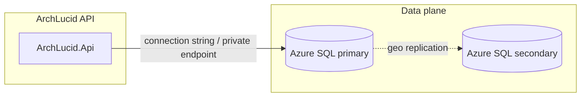

> **Scope:** Runbook: Azure SQL — failover, connectivity, RPO/RTO - full detail, tables, and links in the sections below.

> **Spine doc:** [Five-document onboarding spine](../FIRST_5_DOCS.md). Read this file only if you have a specific reason beyond those five entry documents.

# Runbook: Azure SQL — failover, connectivity, RPO/RTO

**Last reviewed:** 2026-04-16

**Policy targets (by tier):** see **`docs/RTO_RPO_TARGETS.md`** (e.g. production relational RPO under five minutes with geo-replication; development best-effort).

Use this runbook when the primary Azure SQL database is unavailable, when Microsoft initiates a platform failover, or when you are exercising a controlled **geo-failover** drill.

## When to use

- Application health checks report SQL connectivity failures across instances.
- Azure Portal / Azure Monitor shows primary region outage or database **Failover** in progress.
- You are validating **business continuity** requirements (RPO/RTO) for ArchLucid.

## Components (mental model)

**Edges:** TLS SQL connections from the app to the logical server; optional **private endpoint** in the application VNet.

## Immediate triage

1. **Confirm scope:** Is a single pod/instance unhealthy vs widespread SQL errors? Check **`ArchLucid.Api`** logs for connection timeouts, login failures, or firewall denials.
2. **Check Azure resource health** for the SQL server and database (planned maintenance vs unplanned).
3. **Verify secrets:** Connection strings in Key Vault / app configuration still match the intended server and database; password rotation did not leave stale credentials.

## Failover types

| Mechanism | Typical RTO | RPO | Notes |
|-----------|-------------|-----|--------|
| **Auto-failover group** — automatic failover | Minutes (configurable grace) | Near-zero with committed transactions on primary | Preferred HA pattern for production. |
| **Manual geo-failover** | Operator-driven, minutes to tens of minutes | Unreplicated lag on secondary | Use when primary region is lost or for drills. |
| **Zone redundancy** (same region) | Sub-minute for many cases | Low | Protects against zone failure, not full region loss. |

Exact numbers depend on tier, **geo-replication lag**, and write load — treat table values as **planning defaults**, not guarantees.

## Connection strings after failover

- With **failover groups**, applications should use the **read/write listener** hostname provided for the group so connections follow the current primary after failover.
- If you use a **single-server** connection string, you must **update configuration** to point at the new primary after manual failover (avoid this in production; prefer group listener or automated secret rotation).

Store connection strings in **Key Vault** (or managed identity–backed settings) and update via your release pipeline or runbook-approved secret rotation — see **`docs/runbooks/SECRET_AND_CERT_ROTATION.md`**.

## Application behavior

- ArchLucid uses **Dapper** and **resilient SQL** wiring in the API; during failover windows expect **transient errors** — clients should retry with backoff.
- After failover, **no product-specific SQL cache layer** invalidates connections; new connections pick up the new primary automatically if the listener is correct.

## Post-failover validation

1. Run **DbUp** / **`DatabaseMigrator`** in **report-only** or equivalent check if your process requires schema confirmation (optional if schema unchanged).
2. Smoke: create architecture request → run → commit; open governance or comparison endpoints if enabled.
3. Watch **OpenTelemetry** / App Insights for error rate and dependency duration on SQL.

## Recovery / failback

- After a regional event, Microsoft or your team may **fail back** to the original region. Treat failback like a second failover: confirm listener, secrets, and replication health before declaring complete.

## Related

- [MIGRATION_ROLLBACK.md](./MIGRATION_ROLLBACK.md) — schema change rollback posture (distinct from HA failover).
- [SECRET_AND_CERT_ROTATION.md](./SECRET_AND_CERT_ROTATION.md) — credential updates.
- [../DEPLOYMENT.md](../library/DEPLOYMENT.md) — umbrella deploy/rollback.

## Cost and scalability

- **Geo-redundant** configurations increase SQL and egress cost; justify against **RPO/RTO** targets.
- Scale-out of the API tier does not reduce SQL load per request — tune **database tier** and **read replicas** (if used for read-only workloads) separately.
