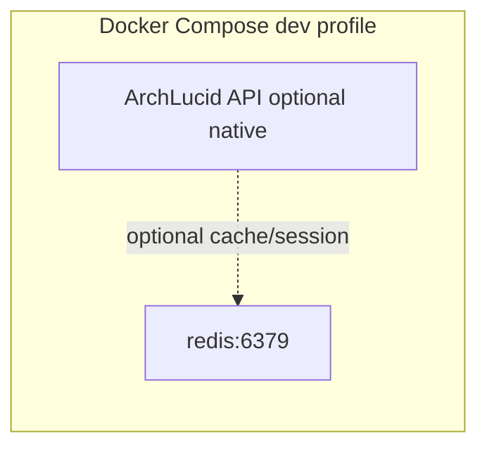

# Redis health (development and cache-oriented deployments)

## Objective

Describe how Redis appears in ArchLucid’s **local Docker Compose** profile, how to verify it is healthy, and what production operators should verify when Redis (or Azure Cache for Redis) backs session/cache features.

## Assumptions

- **Local:** `docker compose up -d` starts the `redis` service with a `redis-cli ping` healthcheck (see repo `docker-compose.yml`).
- **Production:** If you introduce Azure Cache for Redis, networking is private (VNet integration / private endpoint) per organizational standards—not a public endpoint.

## Constraints

- Compose defaults are for **developer laptops**; passwords and ports are not production secrets.
- This runbook does not mandate Redis for core API persistence (SQL remains authoritative for relational data).

## Architecture overview

## Operational checks

### Docker Compose

1. `docker compose ps` — `redis` should be `healthy`.
2. `docker exec -it archlucid-redis redis-cli ping` — expect `PONG`.

### Application

- If the API is configured to use Redis (StackExchange.Redis or similar), confirm connection string points at the **service name** `redis` from within the compose network (`redis:6379`), not `localhost`, when the API runs **inside** compose.
- When the API runs **on the host** and Redis in compose, use `localhost:6379`.

## Security model

- **Production:** TLS to Azure Cache, firewall / VNet rules, least-privilege access keys rotated via `docs/runbooks/SECRET_AND_CERT_ROTATION.md`.
- **Dev:** No TLS on default compose image; acceptable only on loopback-bound ports.

## Reliability

- Redis is a **cache / ephemeral** tier: application behavior should degrade gracefully if Redis is unavailable unless you explicitly require it (then add readiness checks).

## Cost

- Compose: negligible. Azure Cache: SKU and replica count drive cost; right-size for working set and OPS.

## Troubleshooting

| Symptom | Check |
|--------|--------|
| Connection refused | Container up? Port 6379 published? Correct host name from API container vs host? |
| Timeouts | Network policy, max connections, or CPU on small SKUs. |
| Auth errors | Production key rotation; verify secret references in Key Vault / app settings. |
