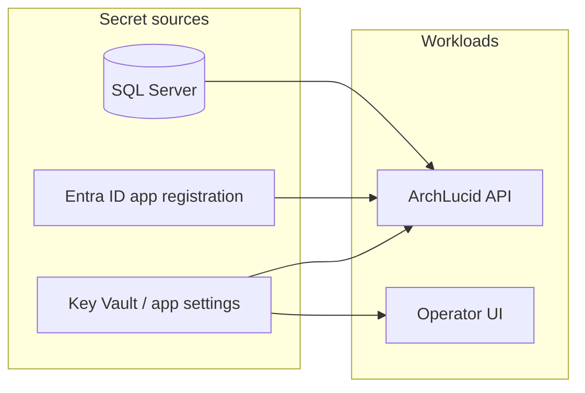

# Runbook: secret and certificate rotation

## Objective

Describe how operators rotate credentials and TLS-related material for ArchLucid deployments without assuming a single cloud SKU. The API and UI are commonly hosted on Azure App Service with secrets in Key Vault or app settings; adjust names to match your environment.

## Assumptions

- You have a maintenance window or blue/green path for app restarts when connection strings or signing keys change.
- SQL connectivity uses private networking (private endpoint / VNet integration); SMB (port 445) is not exposed publicly (see workspace security rules).

## Constraints

- Rotating **`ConnectionStrings:ArchLucid`** requires the API to restart (or reload config if you implement hot reload for that section — not the default).
- Rotating **JWT signing keys** invalidates existing bearer tokens unless you use overlapping keys (not modeled in the default template).
- **Webhook HMAC** secrets (`WebhookDelivery:HmacSha256SharedSecret`) require coordinated updates with every subscriber that verifies signatures.

## Architecture overview (rotation flow)

## Component breakdown

| Asset | Typical location | Consumer | Notes |
|-------|------------------|----------|--------|
| SQL login / AAD auth | Key Vault reference or App Service setting | API (`ConnectionStrings:ArchLucid`) | Prefer Entra ID auth to SQL where supported; avoid plaintext in repo. |
| API keys (`ApiKeys:*`) | App settings / Key Vault | API | Rotating a key strands clients still sending the old value; publish a cutover date. |
| JWT authority / audience | `ArchLucidAuth:*` | API | Wrong metadata URL causes 401 for all JWT clients until fixed. |
| Webhook HMAC | `WebhookDelivery:HmacSha256SharedSecret` | API outbound webhooks | Update digest subscribers before or in sync with API change. |
| TLS certificate (custom domain) | App Service managed cert or Key Vault | App Service / front door | Plan renewal before expiry; monitor expiry in your WAF or Key Vault. |
| OpenAI / embedding keys | `AgentExecution:*`, retrieval sections | API | Rate limits and spend caps may apply after key swap. |

## Data flow (webhook HMAC rotation)

1. Generate a new shared secret in a secure store.
2. Configure subscribers to **accept** signatures with the new secret (dual-verify window) or schedule downtime.
3. Deploy API with the new secret.
4. Remove old verifier from subscribers after traffic is clean.

## Security model

- **Least privilege:** new SQL logins should retain the minimum DDL/DML rights required for ArchLucid migrations and runtime (see `docs/SQL_DDL_DISCIPLINE.md`).
- **Audit:** record who rotated what and ticket linkage; correlate with App Service restart timestamps and SQL audit logs if enabled.

## Operational considerations

- **Cost:** managed certificates and Key Vault operations are usually low; unplanned outages from expired certs are expensive.
- **Reliability:** prefer rolling deployments so at least one healthy instance serves traffic during secret refresh.
- **Scalability:** secret rotation does not change horizontal scale; ensure configuration propagation completes on all instances (App Service restarts all workers on setting change).

## Recovery

- Mis-rotated SQL string: restore previous Key Vault version or roll back App Service deployment slot.
- Broken JWT config: revert `ArchLucidAuth` settings and restart; clients clear cached tokens if needed.
- Webhook signature storms: temporarily disable HMAC enforcement only if product policy allows (document exception); fix secret alignment.

## Related documentation

- Migration safety: `docs/runbooks/MIGRATION_ROLLBACK.md`
- Data archival readiness: `docs/runbooks/DATA_ARCHIVAL_HEALTH.md`
- Private Terraform example: `infra/terraform-private/` (validate locally with `terraform init -backend=false` and `terraform validate`).
