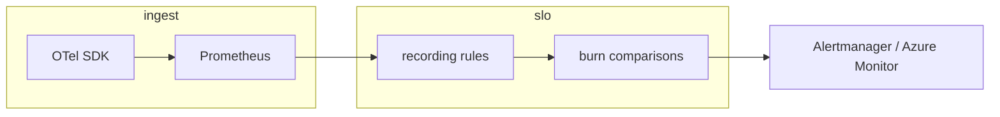

# SLO, Prometheus burn-rate alerts, and Grafana

## 1. Objective

Give operators a **repeatable** way to:

- Define **service level indicators (SLIs)** from OpenTelemetry → Prometheus metrics.
- **Alert on error-budget burn rate** (not only static thresholds) so SLO erosion is visible before backlog gauges explode.
- Optionally **provision** committed Grafana JSON into **Azure Managed Grafana** via Terraform.

## 2. Assumptions

- HTTP traffic is instrumented with **`http.server.request.duration`** (Prometheus names often `http_server_request_duration_seconds_*`) or legacy **`http_server_duration_milliseconds_*`**.
- Prometheus loads **`infra/prometheus/archlucid-slo-rules.yml`** next to **`archlucid-alerts.yml`**.
- **99.5% monthly availability** is the documented HTTP target for burn math in-repo (0.5% error budget). Adjust `0.005` in the rules file if your leadership signs a different number.

## 3. Constraints

- Burn-rate math assumes **5xx** on the HTTP server span/request counter is an acceptable proxy for “bad” requests (no weighting for 4xx SLOs here).
- **LLM** recording rules (`archlucid:slo:llm_prompt_tokens_per_second`) are **throughput** SLIs for capacity/cost dashboards, not an availability ratio; do **not** feed them directly into the HTTP burn-rate formula without defining a separate good/total SLI (e.g. span success vs total LLM spans).

## 4. Architecture overview

**Nodes:** OTel SDK (API/Worker) → OTLP or scrape → Prometheus → `recording_rules` → `alertmanager` / Azure Monitor alert rules → Grafana.

**Edges:** Metric time series → recorded SLO helpers → multi-window comparisons → notifications.

## 5. Component breakdown

| Piece | Location | Role |
|-------|----------|------|
| **API SLO definitions + synthetic slice** | `docs/API_SLOS.md`, `.github/workflows/api-synthetic-probe.yml` | Human-readable SLO table; **external** scheduled `GET /health/live` + `GET /version` (secrets `SYNTHETIC_API_BASE_URL`, optional `SYNTHETIC_API_PROBE_KEY`). Optional separate `GET /health/ready` uses **summary** JSON only (no exception text). `GET /health` (full detail) is **authenticated** (`ReadAuthority`) and is not part of the default anonymous synthetic probe. |
| SLO recording + burn alerts | `infra/prometheus/archlucid-slo-rules.yml` | `archlucid:slo:http_availability:ratio`, burn-rate alerts, **p99** recording (`archlucid:slo:http_p99_seconds`) + `ArchLucidSloHttpP99High`, simple **5xx ratio** alert, combined **outbox depth** alert |
| Threshold / backlog alerts | `infra/prometheus/archlucid-alerts.yml` | Outbox depth, integration backlog, etc. |
| Resilience test philosophy | `docs/CHAOS_TESTING.md` | Deterministic fault injection in unit tests; staging drills pair with these alerts |
| Dashboard JSON | `infra/grafana/*.json`, `infra/grafana/dashboards/*.json` | Import or Terraform-provision |
| Run lifecycle dashboard | `infra/grafana/dashboard-archlucid-run-lifecycle.json` | Per-run variables + authority/LLM/circuit-breaker panels; pairs with [TRACE_A_RUN.md](./TRACE_A_RUN.md) |
| Managed Grafana instance | `infra/terraform-monitoring/main.tf` | `azurerm_dashboard_grafana` |
| Optional Terraform dashboards | `infra/terraform-monitoring/grafana_dashboards.tf` | `grafana_folder` + `grafana_dashboard` (Grafana provider) |
| OTLP + metrics | `ArchLucid.Host.Core/Startup/ObservabilityExtensions.cs` | Traces/metrics exporters |

## 6. Data flow

1. **Counters** increment per HTTP request (status label).
2. **`archlucid:slo:http_availability:ratio`** ≈ non-5xx rate / total rate over 5m.
3. **Burn** (conceptually) = `(1 − availability) / 0.005` for a **0.5%** budget.
4. **Fast burn alert** fires when **both** short (**5m**) and longer (**1h**) windows show burn **> 14.4×**.
5. **Slow burn alert** fires when **30m** and **6h** windows both exceed **6×**.

## 7. Security model

- Grafana API tokens and Azure Monitor connection strings are **secrets**; use Key Vault / pipeline secrets, not git.
- Managed Grafana with **public** endpoints is convenient for pilots; production should prefer **private endpoints** and restricted RBAC.

## 8. Operational considerations

### Why 14.4 and 6?

Those multipliers come from the **Google SRE multi-window, multi-burn-rate** alerting pattern for **monthly** error budgets. They are **paired with specific window lengths** (fast: 5m+1h, slow: 30m+6h), not arbitrary 1h/6h alone.

With a **99.5%** target, the **0.005** divisor scales “how many budgets worth of errors” you are spending. The **14.4 / 6** factors are still the usual **triage knobs**; if pages are too noisy, **lower** the multiplier or **widen** `for:` durations before changing the SLO objective.

### Validate rule syntax before deploy

```bash
promtool check rules infra/prometheus/archlucid-slo-rules.yml
```

Optional: add `promtool test rules` YAML under `infra/prometheus/tests/` when you want time-series regression coverage (see `infra/prometheus/tests/README.md`).

### OTLP and Azure Monitor

Production hosts should set **`Observability:Otlp:Endpoint`** (and optional **`Headers`**) when exporting to a collector or **Azure Monitor’s OTLP endpoint** derived from Application Insights. A **connection string** placeholder lives in **`ArchLucid.Api/appsettings.Production.json`** for operators mapping env vars; wiring the **Azure Monitor OpenTelemetry Distro** is optional and would be a separate package — until then, OTLP remains the supported path.

### Terraform dashboard provisioning

`azurerm_dashboard_grafana` only creates the **workspace**. Pushing JSON uses the **Grafana Terraform provider** behind **`grafana_terraform_dashboards_enabled`** (see `infra/terraform-monitoring/README.md`): typically **apply Grafana first**, copy **`grafana_endpoint`**, create a **service account token**, then **apply** with dashboards enabled.

## 9. Flow diagram (burn-rate)



## 10. External synthetic probes (GitHub Actions)

**Why:** Prometheus reflects **in-cluster / scrape-path** truth and **aggregate** traffic. A **synthetic** check from **GitHub-hosted runners** validates that anonymous probe URLs are reachable over the **internet** (or your chosen base URL) with acceptable latency.

**Workflow:** `.github/workflows/api-synthetic-probe.yml` runs on a **schedule** (default every 15 minutes) and **`workflow_dispatch`**.

**Configure:**

| Secret / variable | Purpose |
|-------------------|---------|
| `SYNTHETIC_API_BASE_URL` | Base URL with **no** trailing slash (e.g. `https://api.example.com`). If unset, the job **skips** successfully (safe for forks). |
| `SYNTHETIC_API_PROBE_KEY` | Optional; sent as `X-Api-Key` when your edge requires it for these paths. |
| Repository variable `SYNTHETIC_MAX_LATENCY_MS` | Optional per-request ceiling in milliseconds (default **15000** in the workflow). |

**SLO relationship:** Authoritative **monthly** availability and **5xx budget** remain the **Prometheus** rules in this runbook. The workflow is a **canary**; see `docs/API_SLOS.md` for the full SLO table and how to extend rollup (e.g. push metrics to Prometheus or Azure Monitor).
