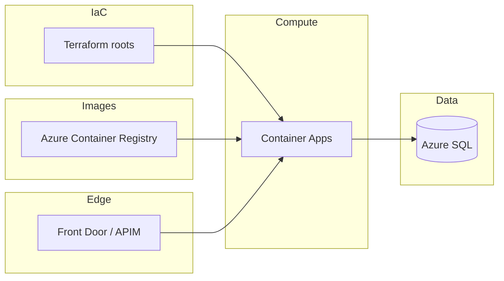

# Staging deployment validation

**Objective:** Confirm the ArchLucid stack in Azure staging is safe to hand to pilot users: Terraform state matches intended resources, containers run current images, SQL is migrated, health checks pass, and one full architecture run can execute and commit with a retrievable golden manifest.

**Assumptions:** You have Azure subscription access, Terraform backends and `tfvars` for staging, ACR push rights, and an API key (or Entra principal) that can call staging APIs.

**Constraints:** This runbook does not modify Terraform modules—only documents apply order and human checks. Adjust names (`staging`, resource groups) to match your environment files under `infra/environments/`.

---

## Architecture Overview



---

## Suggested Terraform apply order

Apply each root with its own backend and `tfvars` (merged state is not required; keep roots isolated per `infra/README.md`).

1. **`infra/terraform-sql-failover/`** — Failover group / listener FQDN for geo-HA SQL when used (`terraform-sql-failover/README.md`).
2. **`infra/terraform-storage/`** — Storage account and blob containers for artifact offload when enabled.
3. **`infra/terraform-private/`** — Optional: VNet, private DNS, private endpoints for SQL and storage before disabling public data-plane paths.
4. **`infra/terraform-keyvault/`** — Key Vault references consumed by apps and Terraform outputs.
5. **`infra/terraform-entra/`** — App registration / API roles when using JWT (`terraform-entra/README.md`).
6. **`infra/terraform-openai/`** — Azure OpenAI resources when not using external model endpoints exclusively.
7. **`infra/terraform-servicebus/`** — Messaging if the deployment uses Service Bus triggers or outbox integration (`terraform-servicebus/README.md`).
8. **`infra/terraform/`** — Core hub (e.g. APIM consumption, managed identity exports) per root README; only if your staging design includes it.
9. **`infra/terraform-container-apps/`** — Log Analytics, Container Apps environment, API + Worker (+ UI when applicable), env vars, connection strings, identity.
10. **`infra/terraform-monitoring/`** — Action groups, metric alerts, optional Grafana (`terraform-monitoring/README.md`).
11. **`infra/terraform-otel-collector/`** — Optional OTLP collector when not exporting directly to App Insights.
12. **`infra/terraform-edge/`** — Front Door + WAF when customer traffic terminates on edge (`terraform-edge/README.md`).
13. **`infra/terraform-logicapps/`** / **`infra/terraform-pilot/`** — Optional workflows and pilot dashboards when staging includes them.

**Validate-only anchor:** `infra/terraform-orchestrator/` is CI-friendly `terraform validate` only (no resources).

Also see **`docs/LANDING_ZONE_PROVISIONING.md`** and **`scripts/provision-landing-zone.ps1`** / **`.sh`** for scripted ordering against your environment files.

---

## Post-Terraform checklist

| Step | Verification |
|------|----------------|
| Container image | Build API (and Worker if separate); tag with build id; push to staging ACR; revision references new digest. |
| DbUp / migrations | API or migrator job reached “up to date”; `ArchLucid.Persistence` scripts applied on staging DB. |
| Secrets | Connection strings, AOAI keys, API keys present in Key Vault / Container Apps secrets (no literals in repo). |
| Identity | Managed identities have RBAC on SQL, storage, and AOAI as designed. |
| DNS / TLS | Public or private hostname matches Front Door / Container Apps custom domain configuration. |

---

## Smoke test (automated)

From repo root after the API is reachable:

```bash
export ARCHLUCID_BASE_URL="https://your-staging-api.example.com"
export ARCHLUCID_API_KEY="..."   # if your host requires X-Api-Key
./scripts/staging-smoke.sh
```

Windows (PowerShell 7+):

```powershell
$env:ARCHLUCID_BASE_URL = "https://your-staging-api.example.com"
$env:ARCHLUCID_API_KEY = "..."   # optional
.\scripts\staging-smoke.ps1
```

**What it does:** anonymous **`/health/live`** and **`/health/ready`**; **`/version`**; then **`POST /v1/architecture/request`**, **`POST …/execute`**, poll **`GET /v1/architecture/run/{runId}`** until **`ReadyForCommit`**, **`POST …/commit`**, and **`GET /v1/authority/runs/{runId}/manifest`**. Writes **`staging-smoke-results.json`** in the current directory (override with **`STAGING_SMOKE_RESULTS_FILE`**).

**Cleanup:** There is no guaranteed multi-tenant-safe delete endpoint for arbitrary runs; the script creates a unique brief per invocation. Retain or archive **`runId`** from the JSON for manual cleanup if policy requires it.

---

## Observability and alerts

| Step | Verification |
|------|----------------|
| Metrics | After one full execute, confirm custom counters/histograms (e.g. **`archlucid_agent_output_*`**, **`archlucid_authority_*`**) appear in Application Insights or your OTLP backend (`docs/library/OBSERVABILITY.md`). |
| Alerts | Trigger a test condition (e.g. temporarily lower a threshold in a **non-production** alert rule, or use a synthetic failure path) and confirm an action group fires email or ticket. |

---

## Security Model

- Staging must use **private** SQL and storage endpoints or restricted NSGs where production does; never expose SMB (port 445) publicly (`Security-Default-Rule-Port-445-Alignment`).
- API keys and JWTs are **short-lived** or **scoped**; smoke scripts read keys from environment variables only.

---

## Reliability, scalability, cost

- **Reliability:** Failover group and multi-replica Container Apps settings should match RTO/RPO documented for pilots.
- **Scalability:** HTTP scale rules and min/max replicas on the API revision should handle expected pilot concurrency.
- **Cost:** Tear down or scale to zero non-prod Container Apps jobs when idle if budgets require it; monitor AOAI and SQL DTU in staging.

---

## Operational Considerations

- Prefer the same **`ArchLucid:AgentOutput:QualityGate`** defaults as production when validating staging behavior (`docs/library/AGENT_OUTPUT_EVALUATION.md`).
- If **`GET /health`** (detailed) returns **401**, rely on **`/health/live`** and **`/health/ready`** for automation; detailed health is authorization-gated in the API pipeline.
