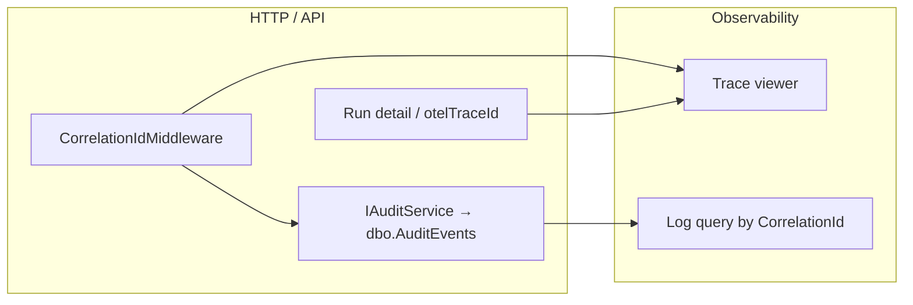

> **Scope:** Trace a run — audit, logs, and distributed traces - full detail, tables, and links in the sections below.

# Trace a run — audit, logs, and distributed traces

**Last reviewed:** 2026-04-16

## 1. Objective

Given a **run id** (no-dash hex or standard GUID string accepted by the API), reconstruct the **end-to-end story** of that run: creation, authority pipeline, commit, governance, exports, and failures — across **durable SQL audit** (`dbo.AuditEvents`), **OpenTelemetry** traces, and **structured logs** (Serilog), so operators can answer “what happened, in what order, under which request?”

## 2. Assumptions

- The API is reachable with a token or **DevelopmentBypass** as in local/CI docs.
- **Trace backend** (Jaeger, Grafana Tempo, Azure Application Insights, etc.) ingests OTLP or platform traces; you have a **trace viewer URL template** (same placeholder semantics as the operator UI — see **§4**).
- **Logs** land in a queryable sink (Seq, Loki, Log Analytics) that indexes **`CorrelationId`** when present.
- **`dbo.Runs.OtelTraceId`** was captured at **run creation** (migration **052**); it is **not** overwritten on later updates.

## 3. Constraints

- **Head-based sampling** may drop exported traces; **`traceparent`** / **`X-Trace-Id`** on the **current** HTTP response still reflect the active `Activity` even when the trace is not stored — a copied id may show “not found” in the backend ([OBSERVABILITY.md](../OBSERVABILITY.md) §Sampling).
- **Background jobs** use **synthetic** `correlation.id` values (e.g. `run:{RunId}`, `integration-outbox:{id}`) per [BACKGROUND_JOB_CORRELATION.md](../BACKGROUND_JOB_CORRELATION.md); they will **not** match the browser’s `X-Correlation-ID` from run creation unless the same id was propagated into the worker span.
- **Baseline mutation logs** (`IBaselineMutationAuditService`) are **not** rows in `dbo.AuditEvents`; use log search for those strings.

## 4. Architecture overview

**Nodes:** Operator / client → ArchLucid API → SQL (`dbo.Runs`, `dbo.AuditEvents`) → background processors (outbox, retrieval, archival).

**Edges:** HTTP request → `CorrelationIdMiddleware` sets **`correlation.id`** on the trace and **`X-Correlation-ID`** on the response → `AuditService.LogAsync` copies correlation into **`AuditEvents.CorrelationId`** when not already set → logs enrich with **`CorrelationId`** where `LogContext` is pushed.

**Flows:**

## 5. Component breakdown

| Component | What it stores | Lookup key |
|-----------|----------------|------------|
| **`dbo.Runs`** | `OtelTraceId` (W3C trace id at creation) | `RunId` |
| **`dbo.AuditEvents`** | `CorrelationId`, `RunId`, `EventType`, `OccurredUtc`, scope | `runId` or `correlationId` query on `GET /v1/audit/search` |
| **OTel traces** | Spans, `correlation.id`, `archlucid.run_id`, `archlucid.stage.name` | Trace id from run detail or span query |
| **Serilog** | `CorrelationId` property when middleware / job pushed it | Same string as audit `CorrelationId` when aligned |

## 6. Data flow (step-by-step)

### Prerequisites

- Set **`NEXT_PUBLIC_TRACE_VIEWER_URL_TEMPLATE`** (UI) and/or **`ARCHLUCID_TRACE_VIEWER_URL_TEMPLATE`** (CLI) with a `{traceId}` placeholder ([CLI_USAGE.md](../CLI_USAGE.md)).
- Know your **Prometheus/Grafana** datasource if using [dashboard-archlucid-run-lifecycle.json](../../infra/grafana/dashboard-archlucid-run-lifecycle.json).

### Step 1 — Resolve the run’s creation trace id

- **HTTP:** `GET /v1/architecture/run/{runId}` → JSON field **`run.otelTraceId`** (may be null for very old runs).
- **CLI:** `archlucid trace {runId}` prints a viewer URL when the template env is set.

### Step 2 — Audit timeline by run

- `GET /v1/audit/search?runId={runIdGuid}&take=500` (scope is tenant/workspace/project from auth).
- Sort mentally by **`occurredUtc`**; expect types such as **`RunStarted`**, **`ManifestGenerated`**, **`ArtifactsGenerated`**, **`RunCompleted`**, governance and export events per [AUDIT_COVERAGE_MATRIX.md](../AUDIT_COVERAGE_MATRIX.md).
- Note **`correlationId`** on rows tied to HTTP-synchronous work.

### Step 3 — Audit by correlation id

- Pick a non-empty **`correlationId`** from Step 2.
- `GET /v1/audit/search?correlationId={cid}&take=500` → all durable audit rows for that logical request (within scope).

### Step 4 — Open the distributed trace

- Paste **`otelTraceId`** into your trace UI (Jaeger: trace page; Tempo: explore; App Insights: transaction search / `operation_Id`).
- Under the authority run, look for child spans / stage tags documented in [BACKGROUND_JOB_CORRELATION.md](../BACKGROUND_JOB_CORRELATION.md) §10.

### Step 5 — Query logs by CorrelationId

- **Seq:** `CorrelationId = "your-id"`
- **Loki:** `{CorrelationId="your-id"}` (label layout may vary)
- **Log Analytics:** filter on the custom dimension your sink maps to **`CorrelationId`**

### Step 6 — Background correlation

- If the run completed via **outbox / async** paths, find spans whose tag **`correlation.id`** matches **`run:{runIdNoDashes}`** or **`integration-outbox:{...}`** per [BACKGROUND_JOB_CORRELATION.md](../BACKGROUND_JOB_CORRELATION.md).

## 7. Security model

- Audit and run detail APIs require **authenticated** scope; do not paste production tokens into shared dashboards.
- **CorrelationId** and **trace ids** are not secrets but can appear in URLs; avoid leaking customer data in screenshots.

## 8. Operational considerations

### Troubleshooting

| Symptom | Likely cause | Mitigation |
|---------|--------------|------------|
| Trace **not found** in backend | Sampling dropped export | Use **`X-Trace-Id`** from the failing response; widen sampling in dev; use tail sampling in collector ([OBSERVABILITY.md](../OBSERVABILITY.md)). |
| **`correlationId` null** on audit row | Written outside normal middleware / activity chain, or very old code path | Check **`Activity.Current`** and `AuditService` enrichment; see unit tests **`AuditServiceCorrelationEnrichmentTests`**. |
| **`otelTraceId` null** on run | Run created before migration **052** or non-authority path | Use audit + logs only. |
| Slow **`audit/search`** | Missing indexes | Ensure migration **`055_AuditEvents_CorrelationId_RunId_Indexes.sql`** applied ([AUDIT_COVERAGE_MATRIX.md](../AUDIT_COVERAGE_MATRIX.md) §Indexes). |

### Related documents

- [OBSERVABILITY.md](../OBSERVABILITY.md) — meters, trace tags, sampling, response headers.
- [BACKGROUND_JOB_CORRELATION.md](../BACKGROUND_JOB_CORRELATION.md) — synthetic correlation ids for workers.
- [AUDIT_COVERAGE_MATRIX.md](../AUDIT_COVERAGE_MATRIX.md) — event types and SQL indexes.
- [CLI_USAGE.md](../CLI_USAGE.md) — `archlucid trace`.
- [SLO_PROMETHEUS_GRAFANA.md](./SLO_PROMETHEUS_GRAFANA.md) — dashboard import.
