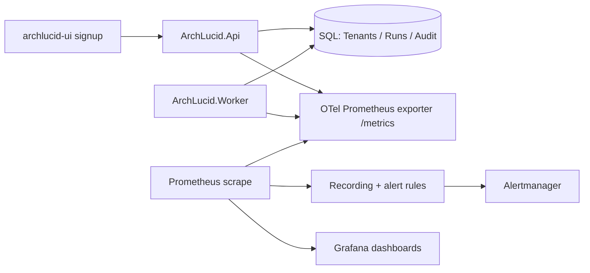

# Trial funnel observability runbook

**Objective:** Operate self-service trial as a **measurable product funnel** (signup → verify → first committed manifest → usage → billing → conversion), with **Prometheus metrics** as the quantitative source of truth and **durable audit types** as the forensic complement.

**Assumptions:** API exposes `GET /metrics` when `Observability:Prometheus:Enabled` is **true**; Grafana is wired from `infra/terraform-monitoring/grafana_dashboards.tf`; Alertmanager routes `severity=page` vs ticket-style labels per your org.

**Constraints:** `archlucid_trial_expirations_total` increments only from **`TrialLifecycleTransitionEngine`** (typically **ArchLucid.Worker**). Live Playwright specs against **API-only** stacks will not emit that series unless the worker transitions a tenant.

---

## Architecture overview (nodes and edges)

---

## Dashboard: `dashboard-archlucid-trial-funnel.json`

**Location:** `infra/grafana/dashboard-archlucid-trial-funnel.json`  
**Terraform:** `grafana_dashboard.trial_funnel` in `infra/terraform-monitoring/grafana_dashboards.tf`

**How to read it**

1. **Signup rate** — `rate(archlucid_trial_signups_total[5m])` by `source`, `mode`.
2. **Signup failures** — `rate(archlucid_trial_signup_failures_total[5m])` by `stage`, `reason`; spikes often correlate with bad client payloads, email policy blocks, or duplicate organization slugs.
3. **Time to first manifest** — histogram `archlucid_trial_first_run_seconds` (Prometheus exposes `_bucket` / `_sum` / `_count`). Use `histogram_quantile(0.5, …)` and `histogram_quantile(0.95, …)` over signup→first coordinator commit for trial tenants.
4. **Active trials** — gauge `archlucid_trial_active_tenants` (cached count published by the outbox operational metrics loop + SQL reader).
5. **Run budget consumption** — histogram `archlucid_trial_runs_used_ratio` at first qualifying commit (`TrialRunsUsed` / limit).
6. **Conversion** — `archlucid_trial_conversion_total` by `from_state`, `to_tier`.
7. **Expirations** — `archlucid_trial_expirations_total` by `reason` (worker lifecycle automation).
8. **Billing** — `archlucid_billing_checkouts_total` by `provider`, `tier`, `outcome`.

---

## Alerting (`infra/prometheus/archlucid-alerts.yml`, group `archlucid-trial-funnel`)

| Alert | Condition (intent) | Default response |
|-------|--------------------|--------------------|
| **ArchLucidTrialSignupFailuresHigh** | `archlucid_trial_signup_failures_total` rate **> 5/min** for **10m** | **Page** on-call — likely client regression, rate limit abuse, email policy, or provisioning fault. |
| **ArchLucidTrialFirstRunLatencyP95High** | `histogram_quantile(0.95, archlucid_trial_first_run_seconds)` **> 600s** sustained | **Ticket** — product/engineering triage (onboarding friction, coordinator backlog, or SQL latency). |

**Unit tests:** `infra/prometheus/tests/trial-funnel-alerts.test.yml` (validated with `promtool test rules` in CI when that job is enabled).

---

## Escalation

1. **Signup failure alert firing** — Check `archlucid_trial_signup_failures_total` breakdown (`stage`, `reason`), then `dbo.AuditEvents` for `TrialSignupFailed` rows (see `docs/AUDIT_COVERAGE_MATRIX.md`). Roll back recent UI/API deploy if `validation` spikes after a release.
2. **First-run latency alert** — Compare **authority pipeline** stage histograms (`archlucid_authority_pipeline_stage_duration_ms`) for the same window; inspect coordinator commit audits (`CoordinatorRunCommitCompleted`).
3. **Billing checkout failures** — Inspect `archlucid_billing_checkouts_total{outcome!="session_created"}` and durable `BillingCheckoutInitiated` / `BillingCheckoutCompleted` pairs.

---

## Automated verification

| Layer | What it proves |
|-------|------------------|
| **`ArchLucid.Api.Tests` / `PrometheusTrialFunnelMetricsSmokeTests`** | After recording, every `archlucid_trial_*` / `archlucid_billing_checkouts_total` name appears on `GET /metrics`. |
| **`archlucid-ui/e2e/live-api-trial-signup.spec.ts`** | Live API path drives signup, duplicate failure, coordinator commit, Noop checkout, and convert; then asserts Prometheus text includes the **API-emitted** funnel metrics (see spec for the **expiration** exception). |
| **`ArchLucid.Core.Tests` / `TrialFunnelInstrumentationTests`** | MeterListener coverage for each instrument. |

---

## Related documents

- `docs/OBSERVABILITY.md` — trial metrics table and meter registration.
- `docs/runbooks/TRIAL_LIFECYCLE.md` — expiry phases (drives `archlucid_trial_expirations_total`).
- `docs/BILLING.md` — checkout providers and webhooks.
