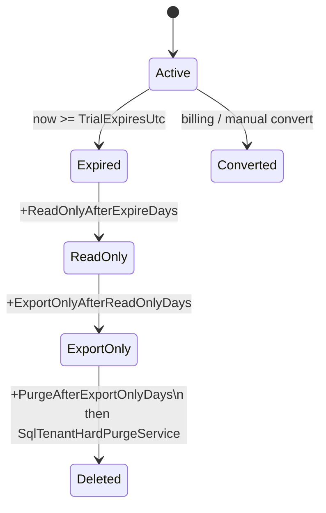

> **Scope:** Trial lifecycle runbook (expiry → read-only → export-only → purge) - full detail, tables, and links in the sections below.

# Trial lifecycle runbook (expiry → read-only → export-only → purge)

**Last reviewed:** 2026-04-17

## Objective

Describe automated **self-service trial** lifecycle transitions after `TrialExpiresUtc`, operator overrides, and **recovery** when data was removed by mistake.

## Assumptions

- Trial parameters follow [TRIAL_AND_SIGNUP.md](../go-to-market/TRIAL_AND_SIGNUP.md) §3 (14-day window is product policy; phase **durations** are configurable under `Trial:Lifecycle`).
- `dbo.Tenants.TrialStatus` drives API behaviour (`GET /v1/tenant/trial-status`, `TrialLimitGate`).
- Worker runs `TrialLifecycleSchedulerHostedService` (leader lease `hosted:trial-lifecycle-automation`).

## Constraints

- **RLS:** scheduler paths use `SqlRowLevelSecurityBypassAmbient` + `sp_set_session_context` (`af_rls_bypass=1`) only where break-glass policy allows (see [SECURITY.md](../SECURITY.md)).
- **Audit:** `dbo.AuditEvents` is **not** deleted by `SqlTenantHardPurgeService` (retention per [AUDIT_RETENTION_POLICY.md](../AUDIT_RETENTION_POLICY.md)).
- **Idempotency:** `TryRecordTrialLifecycleTransitionAsync` updates `dbo.Tenants` only when `TrialStatus` matches the expected prior value; transitions append to `dbo.TenantLifecycleTransitions`.

## Architecture overview

## Component breakdown

| Node | Role |
|------|------|
| `TrialLifecyclePolicy` | Pure UTC rules (`ArchLucid.Application`) |
| `TrialLifecycleTransitionEngine` | One step + durable audit `TrialLifecycleTransition` |
| `SqlTrialLifecycle…` / `DapperTenantRepository` | SQL transition + log insert |
| `SqlTenantHardPurgeService` | Bounded `DELETE TOP` batches; skips `dbo.AuditEvents` |
| `TrialLifecycleSchedulerHostedService` | Poll interval `Trial:Lifecycle:IntervalMinutes` |

## Data flow

1. Worker acquires leader lease → lists tenant ids (`ListTrialLifecycleAutomationTenantIdsAsync`).
2. For each tenant: compute next status → `TryRecordTrialLifecycleTransitionAsync` → optional `PurgeTenantAsync` when entering **Deleted**.
3. Durable audit row documents `{ fromStatus, toStatus, reason }`.

## Security model

- **Trust boundary:** break-glass RLS bypass is limited to configured hosts; purge never targets `dbo.AuditEvents`.
- **API:** `TrialLimitGate` blocks writes in post-active phases; deletes blocked from **ReadOnly** onward.

## Operational considerations

### Manual override (SQL break-glass)

Use `dbo.TenantLifecycleTransitions` as the append-only history. To **hold** a tenant in a phase, update `dbo.Tenants.TrialStatus` only with matching operational approval, then document the change ticket in your ITSM.

### Recovery from accidental deletion

Hard purge removes tenant-scoped application rows. **Recovery** is **point-in-time restore** of the database (or geo-replica promotion) per [DATABASE_FAILOVER.md](DATABASE_FAILOVER.md) — there is no in-product “undelete tenant”.

### Configuration

`appsettings` section `Trial:Lifecycle`:

- `IntervalMinutes` (default **360** — six hours)
- `ReadOnlyAfterExpireDays` (default **7**)
- `ExportOnlyAfterReadOnlyDays` (default **30**)
- `PurgeAfterExportOnlyDays` (default **60**)
- `HardPurgeMaxRowsPerStatement` (default **5000**)

## Related

- [TRIAL_AND_SIGNUP.md](../go-to-market/TRIAL_AND_SIGNUP.md)
- [TRIAL_LIMITS.md](../security/TRIAL_LIMITS.md)
- Migration **079** — `TenantLifecycleTransitions`
