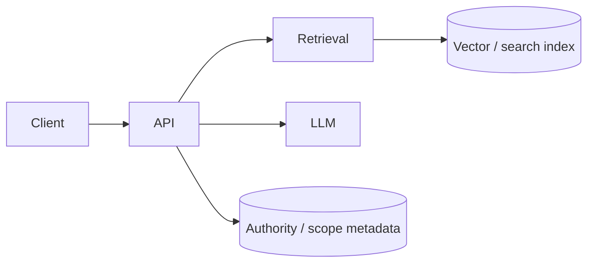

# Threat model sketch — Ask and RAG

## 1. Objective

Capture **primary threats** and **controls** for the **Ask** surface and **retrieval-augmented generation (RAG)** path so security reviews and architecture diagrams stay aligned with implementation choices.

## 2. Assumptions

- The model may be **Azure OpenAI** or a **simulator** in development; production uses **private networking** and **managed identity** where possible.
- **Retrieval** can be in-memory or **Azure AI Search**; vector stores hold **chunks derived from committed runs / ingested context**.

## 3. Constraints

- **Prompt injection** cannot be fully eliminated; mitigate with **grounding rules**, **output filtering**, and **scope isolation**.
- **Third-party model providers** introduce **subprocessor** and **data processing** agreements; document what content is sent.

## 4. Architecture overview

**Nodes:** Client, API (Ask controller + orchestration), **retrieval service**, **embedding** service, **LLM** endpoint, **data stores** (SQL, vector index).

**Edges:** Query → retrieve chunks → build prompt → model completion → response.

## 5. Component breakdown

| Component | Trust boundary |
|------------|----------------|
| **Client** | Untrusted input; may attempt injection, exfiltration via crafted prompts. |
| **API auth** | Entra / API key; must bind **tenant/workspace/project**. |
| **Retriever** | Must **filter by scope** so one tenant cannot retrieve another’s chunks. |
| **LLM** | Treat as **semi-trusted**; may leak training priors; **no secrets** in prompts. |
| **Circuit breaker** | Reduces availability attacks / runaway spend; see `ProblemTypes.CircuitBreakerOpen`. |

## 6. Data flow

1. Authenticated user issues Ask request with thread id / message.
2. API loads **allowed context** (thread history, retrieved docs) **scoped** to tenant.
3. Completion request includes **system + user** messages; response streamed or returned as JSON.

**Failure modes:** empty retrieval, timeout, breaker open → mapped to **problem+json** where applicable.

## 7. Security model

**Threats (examples):**

| Threat | Impact | Mitigations |
|--------|--------|-------------|
| **Cross-tenant retrieval** | Data leak | Scope filters on index queries; tests; optional RLS on source rows (see [MULTI_TENANT_RLS.md](MULTI_TENANT_RLS.md)). |
| **Prompt injection** | Policy bypass, unsafe output | System instructions, allow-lists for tools (if any), human review for high-risk workflows. |
| **Model poisoning / supply chain** | Integrity | Pinned deployments, SBOM + vulnerable package gate in CI (backlog items **219–220**). |
| **Abuse / cost** | Spend, DoS | Rate limits, quotas, circuit breakers, authentication required. |
| **PII in prompts** | Regulatory | Minimize retention; see [PII_RETENTION_CONVERSATIONS.md](PII_RETENTION_CONVERSATIONS.md). |

**Residual risk:** creative prompt attacks and **model hallucination** remain; operators should **not** treat outputs as authoritative without verification for high-stakes decisions.

## 8. Operational considerations

- **Scalability:** retrieval `topK` clamps; batch embedding caps (see performance backlog **232**).
- **Reliability:** degrade gracefully when index unavailable (clear error, no silent empty answers that imply “no data” when the index failed).
- **Cost:** token usage and embedding calls are the main drivers; monitor per deployment.
- **Logging:** log **correlation id**, **thread id**, **scope**; avoid full prompt text at default log levels.

## 9. Evolution

Harden with **content safety** filters (Azure Content Safety or equivalent), **audit trail** of retrieved document IDs on each answer, and **red-team** exercises focused on scope bypass and injection.
