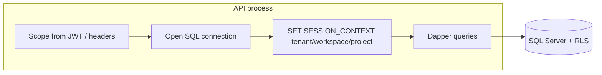

# Multi-tenant row-level security (SQL) — design sketch

## 1. Objective

Describe how ArchiForge could enforce **tenant / workspace / project isolation in SQL Server** so a compromised application tier or query bug cannot read or mutate another customer’s rows, while keeping the current **application-level scope** model (`IScopeContextProvider`) as the primary authorization gate.

## 2. Assumptions

- Primary store is **SQL Server** (Azure SQL or boxed) with **private connectivity**; SMB/file shares are not used for tenant data at the API boundary.
- **Entra ID** (or API keys in constrained scenarios) identifies the caller; **scope** (tenant, workspace, project) is derived from claims or headers and validated in the application layer.
- Teams may roll out RLS **incrementally** (pilot tables first), not as a big-bang migration.

## 3. Constraints

- **RLS does not replace authZ in the API**; it is a **defense-in-depth** control when the connection uses a mid-tier identity (e.g. managed identity) shared across tenants.
- **SESSION_CONTEXT** or **SECURITY POLICY** predicates must stay **simple** to avoid plan regression; heavy joins inside predicates are risky.
- **Operational complexity**: every connection must set context (or use signed security predicates with care). Missing context must default to **no rows** (deny-by-default).

## 4. Architecture overview

**Nodes:** API host, SQL Server, optional **connection pool** (same MI), **RLS policies** on scoped tables.

**Edges:** API opens connection → sets **tenant/workspace/project** in `SESSION_CONTEXT` (or equivalent) → Dapper commands run with RLS filtering rows automatically.

**Flows:**

## 5. Component breakdown

| Layer | Role |
|--------|------|
| **Interfaces** | `IScopeContextProvider`, connection factory abstraction (`ISqlConnectionFactory`). |
| **Services** | Repositories remain parameterized; a **connection decorator** or **session initializer** applies RLS context after open. |
| **Data models** | Tables carry `TenantId`, `WorkspaceId`, `ProjectId` (or normalized scope keys) as today. |
| **Orchestration** | HTTP middleware / background job scope sets the same triple before any repository call. |

## 6. Data flow

1. Request arrives with identity + scope.
2. API validates scope and permissions (policies, governance).
3. Before first SQL use on that request, **SESSION_CONTEXT** is populated with scope (and optionally a **service role** marker).
4. RLS policies: `TenantId = CAST(SESSION_CONTEXT(N'tenant_id') AS uniqueidentifier)` (and similarly for workspace/project), with **NULL context → zero rows**.

## 7. Security model

- **Strengths:** Limits blast radius of SQL injection or missing `WHERE TenantId = @tid` in a new query.
- **Weaknesses:** If the API sets context wrong, RLS will hide data incorrectly or block legitimate access; **misconfigured policies** can cause subtle bugs. Shared connections without per-request context break isolation.
- **Threats mitigated:** lateral movement via ad-hoc SQL, some classes of ORM/query builder mistakes.
- **Not mitigated:** logic bugs that use the **correct** tenant but wrong business rules; **superuser** bypass if someone uses an admin connection without RLS.

## 8. Operational considerations

- **Scalability:** Predicate simplicity keeps plans stable; index **leading columns** on scope keys used in policies.
- **Reliability:** Connection resiliency (`ResilientSqlConnectionFactory`) must **re-apply** session context after reconnect.
- **Cost:** Minimal SQL overhead; engineering cost for migration, testing, and runbooks.
- **Terraform:** RLS is **DDL** (security policies, functions); represent in the **single DDL file** discipline (`ArchiForge.sql`) or a dedicated migration with idempotent guards, aligned with IaC for **environment promotion**, not ad-hoc SSMS edits.

## 9. Evolution

Start with **highest-risk tables** (runs, manifests, conversations). Add **integration tests** that assert cross-tenant reads return empty under RLS. Later, consider **separate database per tenant** only if compliance or noisy-neighbor isolation demands it (higher ops cost).
