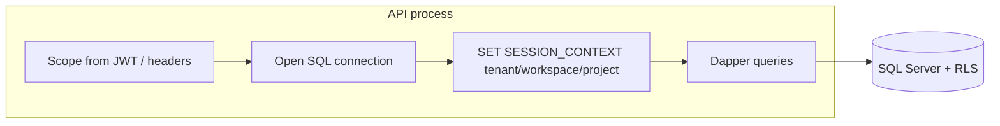

# Multi-tenant row-level security (SQL) — design sketch

## 1. Objective

Describe how ArchiForge enforces **tenant / workspace / project isolation in SQL Server** so a compromised application tier or query bug cannot read or mutate another customer’s rows, while keeping the current **application-level scope** model (`IScopeContextProvider`) as the primary authorization gate.

## 2. Assumptions

- Primary store is **SQL Server** (Azure SQL or boxed) with **private connectivity**; SMB/file shares are not used for tenant data at the API boundary.
- **Entra ID** (or API keys in constrained scenarios) identifies the caller; **scope** (tenant, workspace, project) is derived from claims or headers and validated in the application layer.
- RLS is rolled out on **every authority table that carries the scope triple on the row** (DbUp `036_RlsArchiforgeTenantScope.sql`).

## 3. Constraints

- **RLS does not replace authZ in the API**; it is a **defense-in-depth** control when the connection uses a mid-tier identity (e.g. managed identity) shared across tenants.
- **SESSION_CONTEXT** predicates must stay **simple** to avoid plan regression; heavy joins inside predicates are not used.
- **Operational complexity**: every connection must set context (or use bypass for trusted jobs). Missing context defaults to **no rows** (deny-by-default) when policies are **ON**.
- **Child tables** without denormalized `TenantId` / `WorkspaceId` / `ProjectId` cannot use the same predicate pattern without schema changes (see §9).

## 4. Architecture overview

**Nodes:** API host, SQL Server, optional **connection pool** (same MI), **RLS policies** on scoped tables.

**Edges:** API opens connection → sets **tenant/workspace/project** in `SESSION_CONTEXT` (or equivalent) → Dapper commands run with RLS filtering rows automatically.

**Flows:**



## 5. Component breakdown

| Layer | Role |
|--------|------|
| **Interfaces** | `IScopeContextProvider`, connection factory abstraction (`ISqlConnectionFactory`). |
| **Services** | Repositories remain parameterized; **SessionContextSqlConnectionFactory** applies RLS context after open when `SqlServer:RowLevelSecurity:ApplySessionContext` is true. |
| **Data models** | Scoped tables carry `TenantId`, `WorkspaceId`, and `ProjectId` (or `ScopeProjectId` on `dbo.Runs` for the same semantic “project scope” GUID). |
| **Orchestration** | HTTP pipeline / background job scope sets the same triple before any repository call; migrations and similar use `SqlRowLevelSecurityBypassAmbient`. |

## 6. Data flow

1. Request arrives with identity + scope.
2. API validates scope and permissions (policies, governance).
3. Before first SQL use on that request, **SESSION_CONTEXT** is populated with scope (`af_tenant_id`, `af_workspace_id`, `af_project_id`) and `af_rls_bypass = 0`, unless bypass ambient is active.
4. Security policy **`rls.ArchiforgeTenantScope`** uses **`rls.archiforge_scope_predicate`**: row visible when bypass = 1 or when row scope keys match session context.

## 7. Security model

- **Strengths:** Limits blast radius of SQL injection or missing `WHERE TenantId = @tid` on a covered table.
- **Weaknesses:** If the API sets context wrong, RLS hides data incorrectly or blocks legitimate access; **misconfigured policies** cause subtle bugs. Shared connections without per-request context break isolation.
- **Threats mitigated:** lateral movement via ad-hoc SQL, many classes of ORM/query builder mistakes on **covered** tables.
- **Not mitigated:** logic bugs that use the **correct** tenant but wrong business rules; **superuser** bypass if someone uses an admin connection without RLS; **uncovered** tables (§9).

## 8. Operational considerations

- **App setting:** `SqlServer:RowLevelSecurity:ApplySessionContext` (default **false** in `appsettings.json`) gates whether the stack calls `sp_set_session_context` on each opened connection. Enable only after DbUp **036** is applied and you are ready to turn the security policy **ON**.
- **Enable policy (production):** after `ApplySessionContext` is **true** for all app entry points that hit SQL:

  ```sql
  ALTER SECURITY POLICY rls.ArchiforgeTenantScope WITH (STATE = ON);
  ```

- **Disable for maintenance / debugging:**

  ```sql
  ALTER SECURITY POLICY rls.ArchiforgeTenantScope WITH (STATE = OFF);
  ```

- **Scalability:** Predicate simplicity keeps plans stable; indexes already lead with scope columns on most advisory/alert tables.
- **Reliability:** Connection resiliency (`ResilientSqlConnectionFactory`) re-applies session context when **SessionContextSqlConnectionFactory** wraps the connection.
- **Cost:** Minimal SQL overhead; engineering cost for migration, testing, and runbooks.
- **Terraform / IaC:** RLS is **DDL**; shipped via DbUp migrations and mirrored at the end of `ArchiForge.Data/SQL/ArchiForge.sql` for greenfield parity.

## 9. Covered tables and known gaps (DbUp 036)

**In policy `rls.ArchiforgeTenantScope` (FILTER on all listed tables; ships `STATE = OFF`):**

- `dbo.Runs` — `(TenantId, WorkspaceId, ScopeProjectId)`
- `dbo.DecisioningTraces`, `dbo.GoldenManifests`, `dbo.ArtifactBundles`
- `dbo.AuditEvents`, `dbo.ProvenanceSnapshots`, `dbo.ConversationThreads`
- `dbo.RecommendationRecords`, `dbo.RecommendationLearningProfiles`
- `dbo.AdvisoryScanSchedules`, `dbo.AdvisoryScanExecutions`
- `dbo.ArchitectureDigests`, `dbo.DigestSubscriptions`, `dbo.DigestDeliveryAttempts`
- `dbo.AlertRules`, `dbo.AlertRecords`, `dbo.AlertRoutingSubscriptions`, `dbo.AlertDeliveryAttempts`
- `dbo.CompositeAlertRules`
- `dbo.PolicyPacks`, `dbo.PolicyPackAssignments`
- `dbo.RetrievalIndexingOutbox`, `dbo.ArchitectureRunIdempotency`
- `dbo.ProductLearningPilotSignals`, `dbo.ProductLearningImprovementThemes`, `dbo.ProductLearningImprovementPlans`
- `dbo.EvolutionCandidateChangeSets`

**Not covered (no scope triple on row — application must enforce):**

- Legacy **architecture commit** graph: `dbo.ArchitectureRequests`, `dbo.ArchitectureRuns`, `dbo.AgentTasks`, `dbo.AgentResults`, … (string `RunId` model without tenant columns on those rows).
- **Child / graph tables** keyed only by `RunId`, `SnapshotId`, `ManifestId`, `BundleId`, `ThreadId`, etc.: e.g. `dbo.ContextSnapshots`, `dbo.GraphSnapshots`, `dbo.FindingsSnapshots`, `dbo.FindingRecords`, `dbo.GoldenManifestAssumptions`, `dbo.ArtifactBundleArtifacts`, `dbo.ConversationMessages`, `dbo.PolicyPackVersions`, `dbo.CompositeAlertRuleConditions`, `dbo.EvolutionSimulationRuns`, product-learning bridge tables without scope columns.
- **Operational:** `dbo.BackgroundJobs`, `dbo.HostLeaderLeases`.

**Future hardening:** denormalize `TenantId`, `WorkspaceId`, `ProjectId` onto high-traffic child tables (or add security-barrier views) so predicates can attach without referencing other tables inside the inline function (not supported for RLS predicates).

## 10. Evolution

Pilot **`rls.RunsScopeFilter`** / `runs_scope_predicate` (DbUp 030) is **superseded** by **036**: single function **`rls.archiforge_scope_predicate`** and policy **`rls.ArchiforgeTenantScope`**. Brownfield databases receive 036 via DbUp after 030.

Integration tests: `ArchiForge.Persistence.Tests/RlsArchiforgeScopeIntegrationTests.cs` (SQL Server container) assert cross-tenant isolation on **`dbo.Runs`** and **`dbo.AuditEvents`** with the policy temporarily set to `STATE = ON`.

Later, consider **separate database per tenant** only if compliance or noisy-neighbor isolation demands it (higher ops cost).
