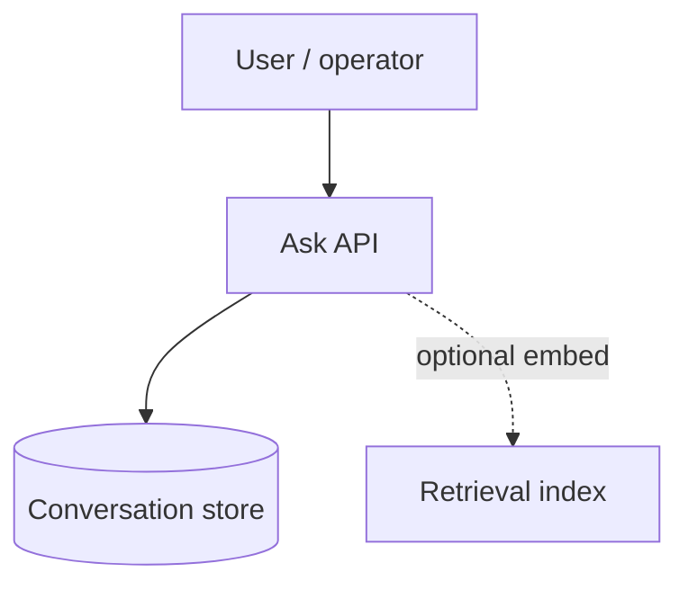

# PII classification and retention — Ask / conversation data

## 1. Objective

Give operators and engineers a **first-principles frame** for what might constitute **personally identifiable information (PII)** in ArchiForge **conversation / Ask** artifacts, how long to keep them, and how to reduce risk without blocking product value.

## 2. Assumptions

- **Ask threads** may contain user free text, pasted logs, names, emails, or internal system names that indirectly identify people or systems.
- **Retention** requirements vary by industry; defaults should be **conservative** and **configurable**.
- Not all deployments store full message bodies in SQL long term; some may truncate or offload to blob with separate lifecycle.

## 3. Constraints

- **Incomplete requirements** are normal: legal/compliance teams may arrive late; design for **classification hooks** and **policy toggles** rather than hard-coded lifetimes in code paths.
- **Encryption at rest** (TDE, Azure SQL) is baseline; this note focuses on **data minimization and lifecycle**.

## 4. Architecture overview

**Nodes:** API (Ask), **Conversation** persistence, optional **retrieval index** (chunks/embeddings), **backup** / **replica** stores.

**Edges:** User message → API → SQL (and optionally indexer); reads for RAG → retrieval layer.

**Flows:**

## 5. Component breakdown

| Piece | PII relevance |
|--------|----------------|
| **Thread metadata** | IDs, scope, timestamps — usually low PII unless titles contain names. |
| **Message bodies** | **High** — free text is the main PII carrier. |
| **Embeddings** | Often **not reversible** to exact text but can leak semantic content; treat as **sensitive** alongside source text. |
| **Audit / logs** | May duplicate snippets; apply **redaction** and short retention. |

## 6. Data flow

Inputs: prompts, follow-ups, optional attachments references.  
Outputs: assistant replies, stored history, indexed chunks.

**Minimization:** avoid logging full prompts at Information level; use **correlation IDs** and hashed identifiers in traces.

## 7. Security model

- **Classification:** treat **message content** as **confidential** by default; allow customers to map tags (e.g. internal-only vs customer-provided).
- **Access control:** scope headers / JWT must gate **list** and **get** thread APIs (already part of product patterns).
- **Retention:** define **TTL or purge job** for soft-deleted / archived threads; align **backup retention** so restores do not violate deletion commitments.
- **Weakness:** without explicit purge, **replicas and backups** extend lifetime of “deleted” data — document **eventual consistency** of erasure.

## 8. Operational considerations

- **Scalability:** purge/archival jobs should be **batched** and **indexed** by `CreatedUtc` / scope.
- **Reliability:** failed purge retries should be idempotent.
- **Cost:** long retention of large blobs and vectors dominates storage; **tiered storage** (cool/archive) if blobs are used.
- **Customer communication:** publish **what is stored**, **where**, and **default retention** in trust docs; avoid over-promising instantaneous global delete.

## 9. Evolution

Phase 1: **configurable retention** + no plaintext in application logs.  
Phase 2: **admin export/delete** APIs and **scheduled compaction**.  
Phase 3: **field-level classification** (labels on threads) driving **automated redaction** before index.
