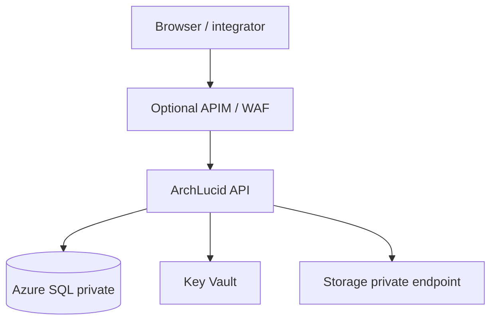

> **Scope:** Terraform / Azure variables (reference sketch) - full detail, tables, and links in the sections below.

# Terraform / Azure variables (reference sketch)

**Purpose:** Map ArchLucid dependencies to IaC variables so environments stay reproducible. This is a **checklist**, not a full module.

## Core variables (typical)

| Variable / setting | Used for | Notes |
|--------------------|----------|--------|
| `sql_connection_string` (secret) | **`ConnectionStrings:ArchLucid`** | Prefer **private endpoint** SQL; no public `0.0.0.0/0`. |
| `storage_account_name` + keys / MI | Artifacts, optional file connectors | **Private endpoint**; **no public SMB 445** exposure. |
| `key_vault_uri` | Secrets, connection strings | App Service / Container Apps **Key Vault references**. |
| `cors_allowed_origins` | Browser SPA origins | Must match **`Cors:AllowedOrigins`** array in app config. |
| `app_insights_connection_string` | OTel / logs | Optional; align with **`Observability:*`** settings. |
| `Observability__Tracing__SamplingRatio` (env) | Trace head sampling | Production: typically **`0.1`**–**`0.25`** on API + worker Container Apps (maps to **`Observability:Tracing:SamplingRatio`**); default **`1.0`** if unset. See [OBSERVABILITY.md](OBSERVABILITY.md). |

## Diagram (dependencies)

## API Management (Consumption, Azure only)

| Variable / setting | Used for | Notes |
|--------------------|----------|--------|
| `enable_api_management` | Turn APIM on | **`false` by default** — laptop / local dev leaves this off. Set **`true`** only when applying Terraform against Azure. |
| `apim_name` | `azurerm_api_management` | Globally unique; **`Consumption_0`** SKU only (see `infra/terraform/`). |
| `archlucid_api_backend_url` | API `service_url` | HTTPS URL the Consumption gateway can reach (typically the public App Service origin for ArchLucid API). APIM **resource addresses** in Terraform may still use the historical `archiforge` token until Phase 7.5 `state mv` ([ARCHLUCID_RENAME_CHECKLIST.md](ARCHLUCID_RENAME_CHECKLIST.md)). |
| `apim_openapi_spec_url` | Optional OpenAPI import | e.g. `https://<host>/swagger/v1/swagger.json`; empty uses bootstrap spec then re-apply with URL. |
| `apim_api_path_suffix` | Gateway path segment | Public base: `https://<apim>.azure-api.net/<suffix>/...` |

**Implementation:** `infra/terraform/README.md` (variables, `terraform.tfvars.example`, WAF / private-backend caveats).

## Front Door + WAF (optional edge)

| Variable / setting | Used for | Notes |
|--------------------|----------|--------|
| `enable_front_door_waf` | Turn Front Door + WAF on | **`false` by default** — see **`infra/terraform-edge/`**. |
| `backend_hostname` | Origin | APIM (`*.azure-api.net`) or App Service API hostname. |

**Implementation:** `infra/terraform-edge/README.md`.

## Private endpoints — SQL + Blob (optional)

| Variable / setting | Used for | Notes |
|--------------------|----------|--------|
| `enable_private_data_plane` | VNet + private endpoints | **`false` by default** — **`infra/terraform-private/`**. |
| `sql_server_id`, `storage_account_id` | Target resources | Required when enabled; see **`checks.tf`**. |

**Implementation:** `infra/terraform-private/README.md` (post-apply: disable public SQL/storage access).

## Entra ID — API application (optional)

| Variable / setting | Used for | Notes |
|--------------------|----------|--------|
| `enable_entra_api_app` | App registration + SP | **`false` by default** — **`infra/terraform-entra/`**. |
| `api_identifier_uri` | JWT **audience** | Must match **`ArchLucidAuth:Audience`** in the API. |

**Implementation:** `infra/terraform-entra/README.md`; sample config **`ArchLucid.Api/appsettings.Entra.sample.json`**.

## Constraints

- Align with org **landing zone** (subnets, DNS zones, private endpoints).
- Keep **DDL** in the single SQL file discipline (`ArchLucid.Persistence/Scripts/ArchLucid.sql`) and apply via pipeline.
