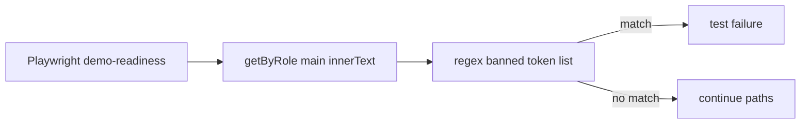

# Demo-mode DOM token scan (Playwright)

## Objective

Prevent internal engineering tokens from appearing in customer-visible `main` content when `NEXT_PUBLIC_DEMO_MODE` is enabled.

## Where it lives

- **`e2e/demo-readiness.spec.ts`** — `demo pages do not leak internal tokens in main content @demo-readiness` walks a fixed path list and asserts `innerText` does not match banned regexes (e.g. `undefined`, `fixture`, `localhost`, `Execute+`).

## Operational notes

- **False positives:** extend patterns carefully — e.g. `null` uses word boundaries to avoid matching unrelated words.
- **Scope:** assertions target `role="main"` only; technical footers or collapsed developer tools may still mention implementation details by design.

## Diagram (flow)

