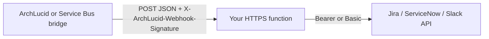

# Integration recipes

**These templates are copy-paste recipes, not first-party product connectors (unless a doc explicitly says otherwise).** You run the HTTPS surface, rotate secrets, and call ArchLucid with **`ARCHLUCID_API_URL`** and **`ARCHLUCID_API_KEY`** (or a vendor HMAC shared secret for inbound webhooks, as in the Jira bridge recipe).

**Product posture (documentation-sourced):**

- First-party **Jira** and **ServiceNow** ITSM bridges are **V1.1** candidates.
- First-party **Slack** as a chat-ops target is **V2**; Microsoft Teams is the first-party operator surface in **V1 / V1.1**.

See [V1_DEFERRED.md](../../docs/library/V1_DEFERRED.md) (sections **6** and **6a**).

## Index — `templates/integrations/`

| Recipe | Description | Complexity | Time to deploy (typical) |
|--------|-------------|------------|---------------------------|
| [pr-review-gate/README.md](pr-review-gate/README.md) | GitHub Actions or Azure Pipelines: create and execute an architecture run for the PR, poll findings, post comment, fail on severity floor | Medium | 2–4 h |
| [governance-notification/README.md](governance-notification/README.md) | CloudEvent `com.archlucid.governance.approval.submitted` → Azure Logic App (Standard), Teams, email, optional Slack; inbound HMAC validation | Medium | 3–5 h |
| [architecture-import/README.md](architecture-import/README.md) | Terraform / ARM / CSV → `POST /v1/architecture/request` (V1) | Low–medium | 1–3 h |
| [jira/jira-webhook-bridge-recipe.md](jira/jira-webhook-bridge-recipe.md) | Bridge pattern and HMAC for **outbound** ArchLucid events to Jira (worked example: `com.archlucid.alert.fired`) | Medium | 2–3 h |
| [jira/jira-webhook-receiver.md](jira/jira-webhook-receiver.md) | Inbound signed JSON, map payload → Jira `POST /rest/api/3/issue` | Medium | 2–3 h |
| [servicenow/servicenow-incident-recipe.md](servicenow/servicenow-incident-recipe.md) | Same → ServiceNow Table `POST /api/now/table/incident` | Medium | 2–3 h |
| [slack/slack-block-kit-recipe.md](slack/slack-block-kit-recipe.md) | Outbound to Slack incoming webhook + Block Kit | Low | 1–2 h |

## Index — `integrations/` (manifest delta and PR comment)

Paired with [pr-review-gate](pr-review-gate/README.md) for **compare** / PR-comment patterns (different API path than the architecture run flow).

| Recipe | Description | Complexity | Time to deploy (typical) |
|--------|-------------|------------|---------------------------|
| [../integrations/github-action-manifest-delta/README.md](../integrations/github-action-manifest-delta/README.md) | GitHub Action: Node entrypoint for manifest / compare delta | Low–medium | 1–2 h |
| [../integrations/github-action-manifest-delta-pr-comment/README.md](../integrations/github-action-manifest-delta-pr-comment/README.md) | Sticky PR comment from the same Markdown source of truth | Low | 0.5–1 h |
| [../integrations/azure-devops-task-manifest-delta/README.md](../integrations/azure-devops-task-manifest-delta/README.md) | Azure Pipelines task wrapper for the same delta | Low–medium | 1–2 h |
| [../integrations/azure-devops-task-manifest-delta-pr-comment/README.md](../integrations/azure-devops-task-manifest-delta-pr-comment/README.md) | ADO PR thread posting for the same pattern | Low | 0.5–1 h |

## Canonical event contracts (do not fork schemas)

- Machine-readable event index: [schemas/integration-events/catalog.json](../../schemas/integration-events/catalog.json)
- CloudEvents, HTTP transport, HMAC (header **`X-ArchLucid-Webhook-Signature: sha256=<hex>`**), and Service Bus notes: [INTEGRATION_EVENTS_AND_WEBHOOKS.md](../../docs/library/INTEGRATION_EVENTS_AND_WEBHOOKS.md)

**HMAC (inbound, consistent across recipes):** [jira/jira-webhook-bridge-recipe.md](jira/jira-webhook-bridge-recipe.md) and [governance-notification/validate-inbound-hmac.sh](governance-notification/validate-inbound-hmac.sh) both validate the **raw body** with the shared secret. Use the same pattern for any HTTPS receiver in front of Logic Apps or container hosts.

**FindingRaised alias:** the catalog does not define a separate `FindingRaised` CloudEvent type. ITSM recipes in this folder use **`com.archlucid.alert.fired`** as the worked example. Swap `data` paths for other types named in the catalog the same way.

## Flow (typical ITSM / chat bridge)

Security: terminate TLS at your public endpoint, store the HMAC shared secret in a vault, use least-privilege credentials for the downstream system, and consider replay control with the catalog’s `deduplicationKey` (where present).
